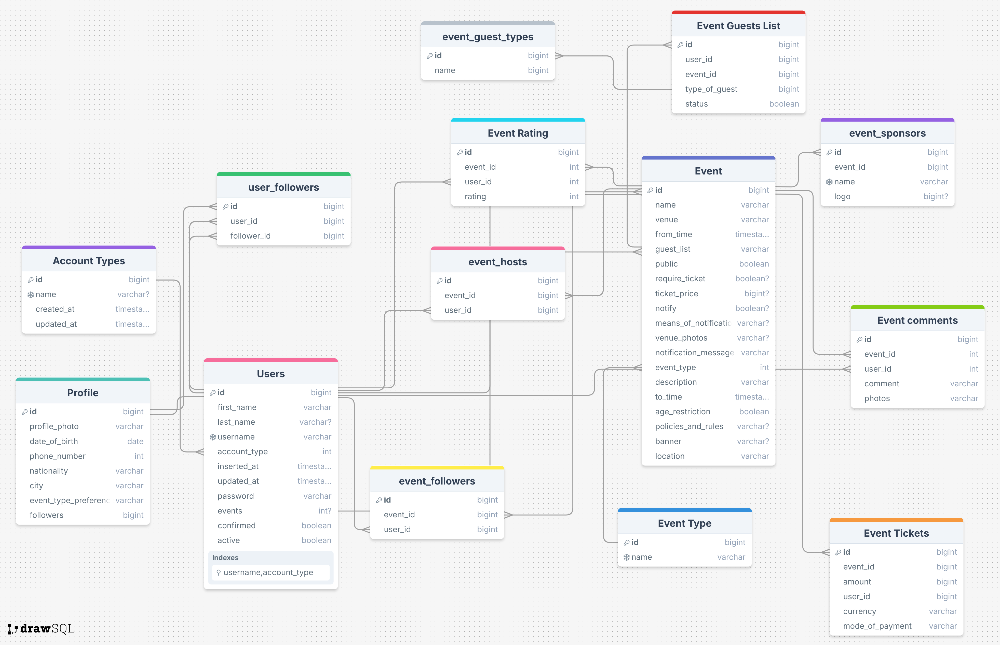

## Architecture Overview

Here's how the layers should work:

```
HTTP Handler
    ↓ calls
Service Layer (domain.AccountTypeService)
    ↓ calls
Repository Interface (domain.AccountTypeRepository)
    ↓ implemented by
Repository Implementation (repositories.AccountTypeRepository)
    ↓ calls
Database Queries (db.Querier - sqlc generated)
    ↓ executes
Database (pgxpool.Pool)
```
